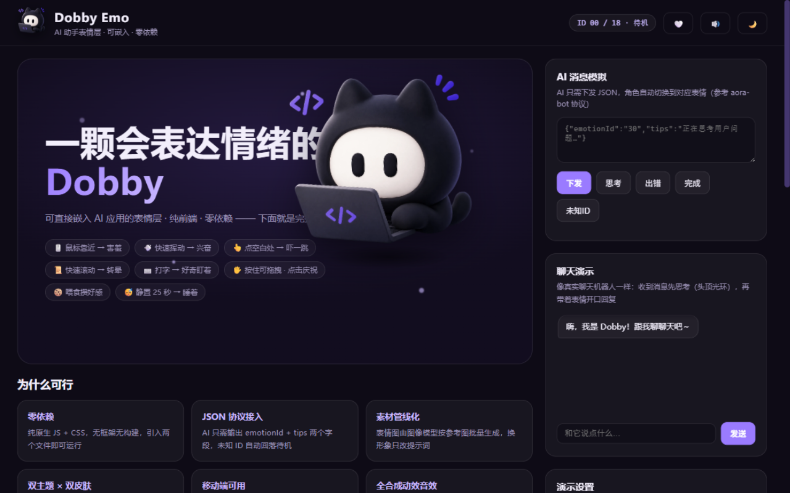
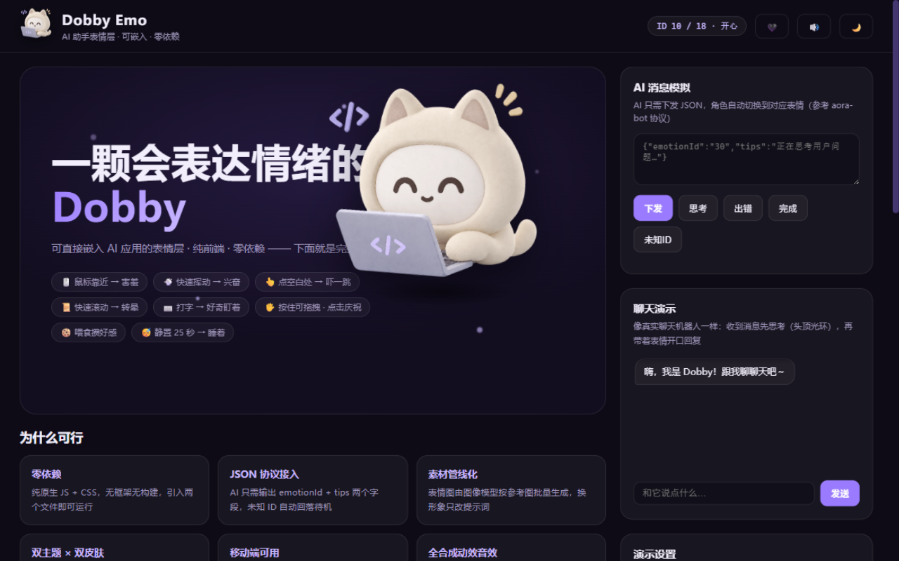

# Dobby Emo · 会表达情绪的小助手

一套面向 AI 助手的**可嵌入表情层方案**：一只抱着电脑的 3D 小猫 Dobby 悬浮在页面上，18 种状态表情，眼神会追着你的鼠标走，情绪从你的每个动作里"长"出来——而不是靠点卡片换图。纯前端、零依赖、两个文件即可接入，移动端同样可用。

<p align="center">
  
  
</p>

> 灵感致谢 [aora-bot](https://github.com/sam70361/aora-bot)（Emotion Ball 表情引擎），本项目在其架构思路上做了形象与交互的重新设计。

**在线演示**：[https://lin-a1.github.io/dobby-emo/](https://lin-a1.github.io/dobby-emo/)

## ✨ 特性

**表情系统**
- 18 种状态表情，ID 分段约定（参考 aora-bot）：`00-09` 生命周期 / `10-29` 情绪 / `30-49` 智能体状态，空位保留、已有 ID 永不变更
- 双皮肤：🖤 经典黑猫 / 🤍 奶油香草，一键切换（主角色、陈列墙、徽标三处联动，选择持久化）
- 表情切换带轻柔缩放过渡；持续状态有专属"进行中"特效：思考=头顶光环、加载=气泡圆点、花痴=飘爱心、出错=故障抖动、生气=冒蒸汽、睡觉=月亮
- 表情数据支持运行时注册 / 导入 / 导出（JSON 配置）

**行为反应层**（无需任何指令，情绪从交互中产生）

| 你的动作 | Dobby 的反应 |
|---|---|
| 鼠标靠近它的脸 | 害羞 → 贴太近变花痴眼 ♥ |
| 快速挥动鼠标 | 星星眼兴奋 |
| 点击页面空白处 | 吓一跳（小跳一下） |
| 快速滚动页面 | 螺旋眼转晕 |
| 在输入框打字 | 好奇地凑过来看 |
| 2 秒内连戳它 3 次 | 生气："别戳了！" |
| 静置 25 秒 / 切走标签页 | 睡着（冒 Zzz），一动就醒 |
| 安静几秒后 | 主动冒话闲聊（深夜有专属台词） |

**动画引擎**（零依赖，原生 JS + rAF）
- 眼神追随鼠标（指数平滑），鼠标静止后自主游移张望
- 拖拽甩动 → 弹簧回位、落地挤压，点击 → 彩带礼花
- 眨眼带回弹过冲、呼吸缩放、说话时身体小抖动
- 共享 rAF 心跳，所有动画帧率无关

**工程化**
- 📱 移动端适配：触摸拖拽（`touch-action` + 缩放换算）、小屏角色自动缩放驻守、滚动渐进淡出
- 🪶 素材全 WebP：两套皮肤总体积约 2.3MB（单张约 130KB），首图预加载 + 加载门控（未就绪前不显示半成品状态）
- 🧩 兼容性：JS 语法控制在 ES2018 级别，CSS 提供 `color-mix` / `mask-image` / `inset` 回退
- 🔊 WebAudio 合成音效（零素材文件，可静音）
- 明暗双主题、`prefers-reduced-motion` 降级、响应式布局

## 🚀 运行

```bash
git clone https://github.com/Lin-A1/dobby-emo.git
cd dobby-emo
python -m http.server 8765
# 打开 http://127.0.0.1:8765
```

纯静态站点，无构建步骤，任意静态服务器（或 GitHub Pages）即可托管。

## 🤖 接入你的 AI

AI 侧只需下发一段 JSON：

```js
dobby.handleAIMessage('{"emotionId":"30","tips":"正在思考用户问题…"}');
// {"emotionId":"32","tips":"出错了"} → 切到出错表情
// 未知 ID / JSON 解析失败 → 自动回落待机，并触发 onError
```

可以接在任意大模型的 Function Calling / 结构化输出后面；页面上的「聊天演示」是完整接法的实时示例。

## 🎨 表情素材再生成

素材由图像编辑模型（参考图 + 逐表情提示词）批量生成，脚本在 `tools/`：

```bash
export APINEBULA_KEY=你的密钥
bash tools/gen-sw.sh        # 黑色皮肤全套
bash tools/gen-sw-white2.sh # 奶油香草皮肤全套
```

流水线：模型出图（透明底 PNG，存至 `assets/*/raw/`）→ 浏览器端 alpha 腐蚀去毛边 → canvas 编码转 WebP → 替换 `assets/sw|sw-white/`。换形象只需换参考图与提示词。

## 📁 目录结构

```
├── index.html            # 入口页（演示 + 可行性说明 + 接入示例）
├── compare.html          # 形象候选对比页（设计过程工具）
├── css/style.css         # 主题 / 动效 / 特效层 / 移动端适配
├── js/
│   ├── emotions.js       # 表情注册表（ID 分段 + 素材路径 + 特效标记）
│   ├── dobby.js          # 引擎核心（弹簧物理 / 心跳 / 协议 / 粒子）
│   ├── main.js           # 行为反应层 + 羁绊 + 聊天演示 + 皮肤
│   └── eyes.js           # 矢量眼引擎（实验功能，默认未启用）
├── assets/sw,sw-white/   # 黑 / 白两套表情素材（WebP）
├── tools/                # 素材批量生成脚本
└── docs/screenshots/     # README 截图
```

## 📄 开源许可

- **代码**（`js/`、`css/`、`index.html` 等）：以 [MIT License](LICENSE) 开源，可自由使用、修改、分发——也欢迎把你的 AI 接进来玩。
- **形象素材**（`assets/` 目录下的 Dobby 图像）：由 AI 生成，与本仓库代码一同提供用于学习演示，**请勿用于商业用途**；商业使用请先联系作者。

除此之外，本项目的诞生受益于 [aora-bot](https://github.com/sam70361/aora-bot) 的思路启发与开源图像模型，一并致谢。
